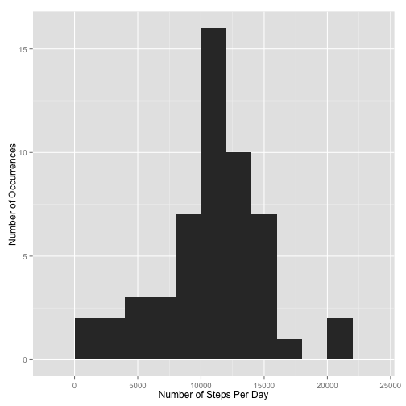
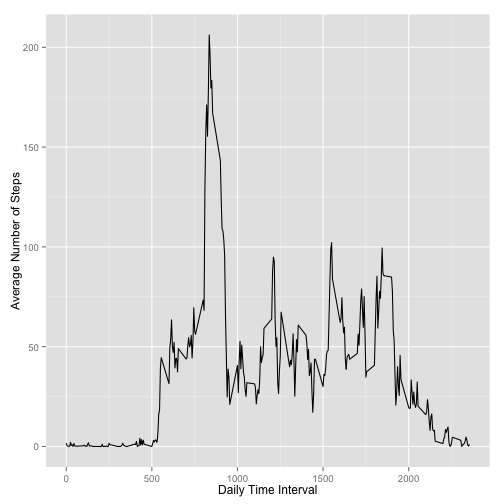
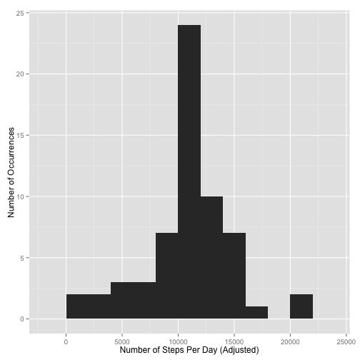
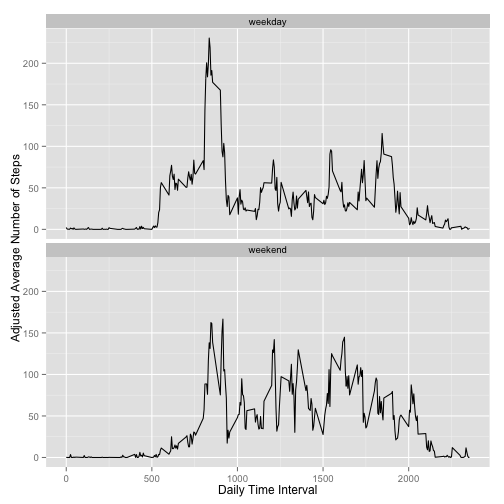

# Step Activity Data Analysis
- Course: Reproducible Research (repdata-013)
- Project: Course Project 1
- Author: Patrick Charles


## Prerequisite libraries
ggplot2 is used for all plots, and the dplyr pipeline is used for processing.

```r
    library(ggplot2)
    library(dplyr)
```

## Load and preprocess the data

### Unzip, load and clean
The activity monitoring data is unzipped and loaded from csv into a dataframe.
A dplyr pipeline is used to clean up the data, reformatting date fields.


```r
    unzip("activity.zip") # extract the data
    steps <- read.csv("activity.csv")
    tdf.steps = tbl_df(steps) # use dplyr to reformat the dates
    tdf.filtered <- tdf.steps %>% mutate(date = as.Date(date))
```

### Daily step totals
Data is grouped by date and a second dataset is created w/ daily step totals.

```r
    tdf.dailysteps <-
        tdf.filtered %>%
            group_by(date) %>%
                mutate(sum = sum(steps, na.rm=T)) %>%
                  summarize(totalsteps=sum(steps))
```


## What is mean total number of steps taken per day?

### Histogram of step totals by number of occurrences
The daily step total data is used to create the plot.

```r
    ggplot(tdf.dailysteps, aes(x=totalsteps)) +
        geom_histogram(binwidth=2000) +
        xlab("Number of Steps Per Day") +
        ylab("Number of Occurrences")
```

 

### Statistics on the daily step totals

```r
    meansteps <- as.integer(mean(tdf.dailysteps$totalsteps, na.rm=T))
    mediansteps <- median(tdf.dailysteps$totalsteps, na.rm=T)
```
The mean of the number of steps per day is **10766**.  
The median number of steps per day is **10765**.


## What is the average daily activity pattern?

### Average daily activity
A new dataset is created which groups the totals by interval and
averages across all days:

```r
    tdf.intervals <-
        tdf.filtered %>%
            group_by(interval) %>%
                summarize(avgsteps = mean(steps, na.rm=T),
                          totalsteps = sum(steps, na.rm=T))
```

### Average steps by 5-minute interval
A time-series plot of the average step counts by 5-minute interval is created:

```r
    ggplot(tdf.intervals, aes(x=interval, y=avgsteps)) + geom_line() +
        xlab("Daily Time Interval") + ylab("Average Number of Steps")
```

 

### Maximum average step count by 5-minute interval
We can find the highest average steps and the associated interval.

```r
    maxsteps <- as.integer(max(tdf.intervals$avgsteps))
    maxinterval <- subset(tdf.intervals, totalsteps ==
                          max(tdf.intervals$totalsteps))$interval
```

The interval containing the highest number of steps
is **835**, with **206** steps on average


## Imputing missing values

### Intervals with missing values

```r
    missingcount <- sum(is.na(tdf.filtered$steps))
```
The number of intervals with no recorded steps is **2304**

### Strategy for filling in missing values
Missing values are replaced with the average total steps for the given
interval.

```r
    ## replicate the avg steps per interval for the extent of the data
    tdf.intervals.avgs <- rep(tdf.intervals$avgsteps, 61)
    ## clone the filtered data and add a row index
    tdf.adj <- tdf.filtered
    tdf.adj$id <- seq.int(nrow(tdf.adj))
    ## apply the avg steps correction to fields with NA
    tdf.adj$steps <-
        ifelse(is.na(tdf.adj$steps),
               tdf.intervals.avgs[tdf.adj$id],
               tdf.adj$steps)
```

### Histogram of adjusted step totals by number of occurrences
Note that the imputed/adjusted steps data results in a higher number
of occurrences in the center of the histogram, increasing the mid-point from
16 to 24 days.

```r
    tdf.dailysteps.adj <-
        tdf.adj %>%
            group_by(date) %>%
                mutate(sum = sum(steps, na.rm=T)) %>%
                    summarize(totalsteps=sum(steps))

    ggplot(tdf.dailysteps.adj, aes(x=totalsteps)) +
        geom_histogram(binwidth=2000) +
        xlab("Number of Steps Per Day (Adjusted)") +
        ylab("Number of Occurrences")
```

 

### Statistics on the imputed/adjusted daily step totals

```r
    meansteps.adj <- as.integer(mean(tdf.dailysteps.adj$totalsteps, na.rm=T))
    mediansteps.adj <- median(tdf.dailysteps.adj$totalsteps, na.rm=T)
    mediansteps.adj <- as.integer(mediansteps.adj)
```
The mean of the number of adjusted steps per day is **10766**.  
The median number of adjusted steps per day is **10766**.

These values are nearly the same as the estimated value above 
and result in a slightly different median value.


## Are there differences in activity patterns between weekdays and weekends?

### Dates are classified as weekend/weekday in a new factor column

```r
    ## a function for determining date 'type' (weekday or weekend)
    dateToType <- function(date) {
        dayIndex <- format(date, "%u")
        factor(ifelse(dayIndex %in% c(6, 7), "weekend", "weekday"))
    }

    ## adjusted data with an additional date type factor column
    tdf.adj.factored <-
        tdf.adj %>% mutate(daytype = dateToType(tdf.adj$date))
```

### Weekday and weekend average steps by 5-minute interval are plotted.

```r
    ## weekday/weekend average steps by 5-minute interval
    tdf.intervals.factored <-
        tdf.adj.factored %>%
            group_by(interval, daytype) %>%
                summarize(avgsteps = mean(steps, na.rm=T),
                         totalsteps = sum(steps, na.rm=T))

    ggplot(tdf.intervals.factored, aes(x=interval, y=avgsteps)) +
           geom_line() + facet_wrap(~daytype, nrow=2) + 
           xlab("Daily Time Interval") +
           ylab("Adjusted Average Number of Steps")
```

 

### Conclusion
Weekend adjusted step averages are generally higher than
weekday levels, except in the case of early morning hours.  

On weekday mornings, steps are higher than weekend mornings, 
presumably due to workday morning activity or office commuting.
